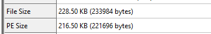
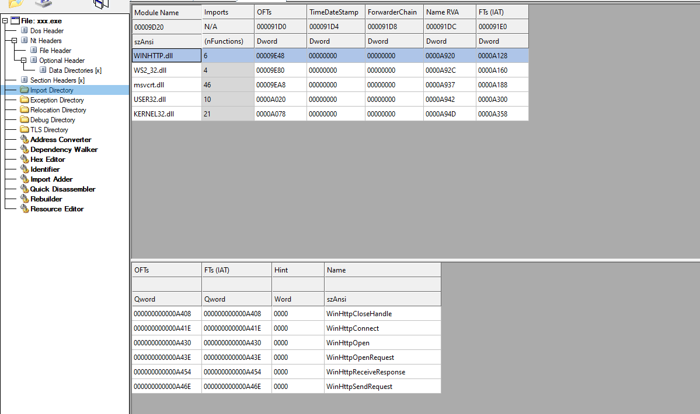
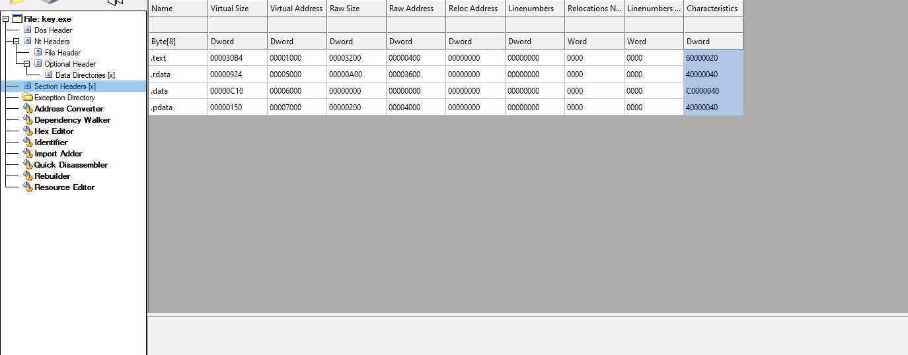

# Bypassing Antivirus: Scantime using nostdlib Technique

Hi, everyone! In this post, I'll share a technique to bypass antivirus detection during scan time using the nostdlib approach. This method is particularly useful for penetration testers and security researchers looking to evade antivirus software.

## I. How Antivirus Scanning Works
Need to ask why an antivirus program considers an executable file to be malicious.
From what I know, there are two ways antivirus software scans files:

1. **Scantime**: The antivirus scans the file before execution, analyzing its structure and signatures.

2. **Runtime**: The antivirus monitors the file during execution, looking for suspicious behavior.

When a file is created and written to disk, antivirus immediately analyze it. Typical malware are easily to detect because they leave many traces: runtime libraries, sensitive API calls, sensitive string, high entropy,....


## II. What is Nostdlib technique?

The **nostdlib** technique can builds binary without any standard libraries. This produces a minimal PE file with almost  no typical loader artifacts, significantly reducing the chances of being caught during scantime. 

*Figure 1: Binary still contains imports when compiling normally*



*Figure 2: When compile with Nostdlib*



Can see that when compiling with nostdlib, the import directory will no longer be present.

the file size will be significantly reduced because the compiler no longer links any C runtime (CRT), utility functions (``memcpy, memset, sprintf,...``). The binary only contain the code written by programmer, without any additional auxiliary code. 

### Example:

```c
#include <stdio.h>

int main(){
    MessageBox(NULL, "Hello World", "My MessageBox", MB_OK);
    return 0;
}
```
A normal "Hello World" program when i build with clang is about **80 KB**

```c
#include <stdio.h>
#include <windows.h>
#include "api_resolve.h"

int _main(){
    DWORD kernel32Hash = calculateHash("kernel32.dll");
    PVOID kernel32Base = findModuleByHash(kernel32Hash);

    typedef HMODULE (WINAPI *LoadLibraryA_t)(LPCSTR);
    LoadLibraryA_t pLoadLibraryA = (LoadLibraryA_t)findApiByHash(kernel32Base, calculateHash("LoadLibraryA"));

    HMODULE hmsvcrt = pLoadLibraryA("USER32.dll");

    typedef int (WINAPI *MessageBoxA_t)(HWND, LPCSTR, LPCSTR, UINT);
    MessageBoxA_t pMessageBox = (MessageBoxA_t)findApiByHash(hmsvcrt, calculateHash("MessageBoxA"));

    pMessageBox(NULL, "Hello World", "My MessageBox", MB_OK);
    return 0;
    
}
```
When i compile with nostdlib, the fize size is **7 KB**


## III. Why Does Nostdlib Help Bypass Scantime Detection?

After understanding what nostdlib does, the next question is:
Why does removing the standard library drastically reduce antivirus detection rates?

### 1. No Import Table → No Static API Signatures
Most antivirus engines heavily rely on import-based detection during scan time.
If your executable imports:
```
VirtualAlloc
VirtualProtect
CreateThread
WriteProcessMemory
LoadLibraryA
```
…these API names alone are enough to get you flagged.

But a nostdlib binary has an empty (or extremely small) Import Table, because:

1. You no longer import ```kernel32.dll, msvcrt.dll, user32.dll, …```

2. You resolve functions manually (PEB lookups + hashing)

3. AV cannot scan for suspicious API names because they simply do not exist in the binary

This removes one of the strongest static detection vectors.

### 2. No CRT = No Compiler Fingerprints

AV engines use compiler fingerprints to detect suspicious binaries.

With normal compilation, PE files contain:

1. Rich Header

2. .CRT section

3. .pdata / .xdata exception info

4. /DEFAULTLIB:libcmt

5. /DEFAULTLIB:ucrtbase

6. C++ RTTI, SEH metadata

7. Startup code signatures (mainCRTStartup, _scrt_common_main_seh)

These are extremely easy to detect.

A **nostdlib binary contains NONE of these**
To AV, the executable looks like:

1. A minimal loader

2. A hand-crafted PE

3. A benign test file without runtime baggage

This significantly reduces ML static scores and heuristic triggers.

### 3. Lower Entropy → No Packer-like Behavior

Packed malware often has high entropy, which AV flags.

Nostdlib binaries:

1. Have low entropy

2. Contain no compressed stub

3. Have no encrypted CRT data

This gives a benign entropy profile, which improves scanning results.

### 4. Simplified PE Structure

A typical nostdlib PE contains only:
```
.text
.rdata (optional)
.data  (optional)
```

This is extremely small compared to a normal executable containing:
```
.text
.rdata
.data
.pdata
.idata
.CRT
.tls
.xdata
.rsrc
.reloc
debug
manifest
```

The fewer sections a file has, the fewer indicators antivirus systems can analyze.


| Feature | Normal Build| nostdlib Build |
| --- | --- | ---|
| Import Table | Many APIs | None / Minimal|
| PE Sections | ~8–12 | 2-3 |
| File Size| Big | Small|
|Static Strings| Many | Very few|

## IV. Limitations: What Nostdlib Cannot Bypass

Nostdlib is highly effective at bypassing static detection (scantime),
but does NOT bypass modern EDR runtime defenses, such as:

1. API hooking

2. Syscall tracing

3. ETW (Event Tracing for Windows)

4. Memory scanning

5. Shellcode detection

6. Behavior correlation

Runtime engines like CrowdStrike, SentinelOne, Microsoft Defender ATP can still detect:

1. Suspicious memory allocations

2. Thread injection

3. RWX memory

4. Manual mapping

5. Process hollowing

6. Beacon communication patterns

So nostdlib should be considered a scantime evasion technique, not a complete EDR bypass.

## V. Implementing API Resolve for Nostdlib

To build functional nostdlib payloads, must implement:

1. PEB walking to enumerate loaded modules

2. Hash-based API extraction

3. Direct syscalls or indirect syscalls

4. Custom entrypoint

5. Custom PE startup logic if needed

A simple resolver flow:

```
PEB → Ldr → InMemoryOrderModuleList → kernel32.dll base
    → Export Directory → Function Name → Hash → RVA → Virtual Address
```


This avoids linking ```kernel32.lib``` and ```user32.lib```, keeping the Import Table empty.


## VI. Conclusion

The nostdlib technique is one of the most effective methods defeating classical antivirus scantime analysis
